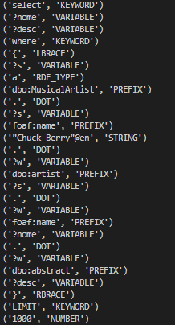

# TPC4: Analisador Léxico

- **Data:** 5 de março de 2025
- **Autor:** Carlos Eduardo Martins de Sá Fernandes :: A100890


## Resumo

Este analisador léxico tem como objetivo transformar um texto numa linguagem de query numa sequência de tokens que representam elementos sintáticos da linguagem, como palavras-chave (select, where), variáveis (?nome), strings ("Chuck Berry"@en), números (1000), entre outros.

Para isso, foi necessário:

1. **Definir uma lista de tokens que representam os elementos da linguagem**:
   - A lista `tokens` contém os tipos de tokens que a linguagem será capaz de reconhecer. Isso inclui palavras-chave como `KEYWORD`, variáveis com `VARIABLE`, e outros como `STRING` (strings entre aspas) e `NUMBER` (inteiros).
   - Exemplo: `"select"`, `"?nome"`, `"Chuck Berry"` são identificados como tokens de tipos diferentes.

2. **Criar expressões regulares para identificar cada token**:
   - As expressões regulares são usadas para definir o formato que cada token pode ter. Por exemplo:
     - `t_KEYWORD = r'select|where|LIMIT'`: Reconhece as palavras-chave `select`, `where` e `LIMIT`.
     - `t_VARIABLE = r'\?[a-zA-Z0-9_]+'`: Reconhece variáveis que começam com `?` seguidas por letras, números ou underscore.
     - `t_STRING = r'"[^"]+"(@[a-zA-Z]+)?'`: Reconhece strings que estão entre aspas, e podem ter uma anotação de idioma após o `@`.
   - Exemplo: A string `"Chuck Berry"@en` seria identificada como um token do tipo `STRING`.

3. **Ignorar espaços em branco e comentários para evitar interferências na análise**:
   - O comando `t_ignore = ' \t\r\n'` faz com que o lexer ignore espaços em branco, tabulações e quebras de linha, pois estes caráteres não alteram a lógica da linguagem.
   - A função `t_COMMENT` ignora qualquer linha que começa com `#`, tratando-a como um comentário. Exemplo: `# DBPedia: obras de Chuck Berry` será ignorado.

4. **Tratar erros léxicos para lidar com entradas inválidas**:
   - A função `t_error` lida com qualquer caráter ou sequência que não corresponde a nenhum token definido. O código imprime uma mensagem de erro e descarta o caráter inválido com `t.lexer.skip(1)`.
   - Exemplo: Se um caráter estranho como `@!` aparecer, ele será descartado e uma mensagem de erro será exibida.

# Resultados

Texto utilizado para teste:
```
# DBPedia: obras de Chuck Berry
select ?nome ?desc where {
?s a dbo:MusicalArtist .
?s foaf:name "Chuck Berry"@en .
?w dbo:artist ?s .
?w foaf:name ?nome .
?w dbo:abstract ?desc
} LIMIT 1000
```

Resultado da execução do analisador léxico:

##### 