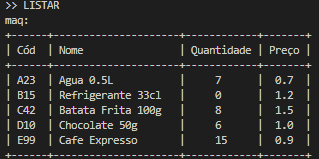

# TPC5: Máquina de Vending

- **Data:** 11 de março de 2025
- **Autor:** Carlos Eduardo Martins de Sá Fernandes :: A100890

## Resumo

Este programa simula uma máquina de vending que gere o stock de produtos e processa comandos para interação com o utilizador. O funcionamento é baseado num sistema de saldo e moedas, onde o utilizador pode comprar produtos, adicionar moedas e calcular o troco.

### Funcionalidades principais

1. **Carregar e salvar o stock de produtos**:
   - O stock é carregado a partir de um ficheiro JSON (`stock.json`) quando o sistema é iniciado.
   - Alterações no stock, como a quantidade de produtos comprados, são salvas no ficheiro no fim da utilização.

2. **Interação com o utilizador**:
   A máquina aceita os seguintes comandos:
   - **LISTAR**: Exibe todos os produtos com informações como código, nome, quantidade e preço.
   - **MOEDA**: O utilizador pode inserir moedas (por exemplo, `1e`, `50c`, etc.), e o saldo é atualizado conforme as moedas inseridas.
   - **SELECIONAR [CÓDIGO]**: O utilizador escolhe um produto pelo código. Se o saldo for suficiente, o produto é vendido (quantidade reduzida e saldo atualizado).
   - **SAIR**: Finaliza a interação, calcula o troco com base no saldo restante e salva o stock.

3. **Tokens e Análise Léxica**:
   - O input do utilizador é processada por um analisador léxico usando a biblioteca `ply.lex`.
   - O analisador reconhece comandos como `LISTAR`, `MOEDA`, `SELECIONAR`, `SAIR`, valores de moedas e códigos de produtos.

4. **Cálculo de Troco**:
   - Quando o utilizador decide sair, o sistema calcula o troco com base no saldo restante e o devolve em moedas disponíveis (`1e`, `50c`, etc.).

## Lista de resultados

1. **Inicialização**
    ##### 

2. **Listar**
    ##### 

3. **Selecionar com saldo insuficiente**
    ##### 

4. **Inserir moedas**
    ##### 

5. **Selecionar**
    ##### 

6. **Sair**
    ##### 

7. **Listar com produto em falta**
    ##### 

8. **Selecionar produto com falta de stock**
    #####    

9. **Reticências (mostrar saldo)**
    #####    
    
                           