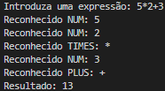

# TPC6: Analisador Léxico e Sintático para Expressões Aritméticas

- **Data:** 19 de março de 2025
- **Autor:** Carlos Eduardo Martins de Sá Fernandes :: A100890

## Resumo
Este programa implementa um analisador léxico (lexer) e um analisador sintático (parser) para validar expressões aritméticas simples, como 5 + 3 * 2, produzindo o seu resultado.

### Analisador Léxico:
  1. Reconhece números inteiros (NUM).
  2. Identifica operadores + (PLUS), - (MINUS) e * (TIMES).
  3. Ignora espaços em branco e quebras de linha.

### Analisador Sintático:
  1. Valida as expressões.
  2. Garante a precedência correta dos operadores (* antes de + e -).
  3. Analisa e processa o input, garantindo a conformidade com as regras gramaticais definidas

    Expressão  → Termo  ( ('+' | '-') Termo )*
    Termo      → Fator  ( '*' Fator )*
    Fator      → NUM

#### Explicação:

**Expressão**
- Representa uma soma ou subtração de Termos.
- Exemplo: 2 + 3 - 1

**Termo**
- Representa uma multiplicação de Fatores.
- A multiplicação tem maior precedência do que soma e subtração.
- Exemplo: 5 * 3 será resolvido antes da adição em 2 + 5 * 3.

**Fator**
- Representa um número (NUM).
- Exemplo: 2, 5, 3 são fatores individuais.

## Resultados

**Exemplo de Utilização**
##### 